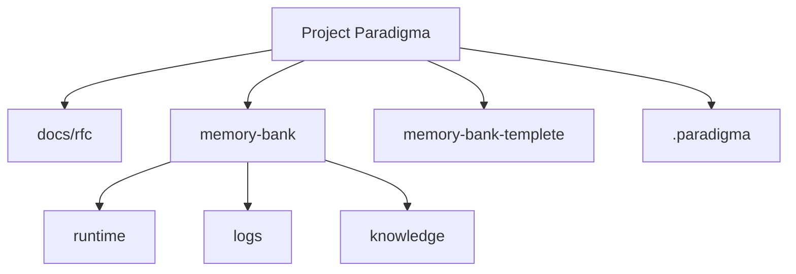

# Project Paradigma

*OKF-compatible Agent Memory Runtime Framework*

当前版本：`0.4.0`

## 核心理念

Project Paradigma 是一个 IDE 无关的 Agent 外部记忆运行框架。它以 OKF-compatible Markdown 知识库为数据基础，以 Paradigma 语义模型定义文档角色，以 Agent Runtime Protocol 规定读取与维护行为，并通过确定性工具链防止记忆腐化。

它解决 LLM 辅助编程中的三个核心痛点：

- **上下文腐化**：会话变长后，Agent 逐渐遗忘早期约定和决策。
- **注意力涣散**：Token 窗口塞入过多细节时，Agent 对架构约束的注意力被稀释。
- **会话间不连续性**：每次新建对话时 Agent 从零开始，无法继承历史上下文。

通过将长期知识、运行状态和操作日志外化到结构化文件中，Paradigma 让 Agent 每次都能快速、可验证地"上车"。

## 当前能力

- **三态 Memory-Bank**：用 `runtime/`、`logs/`、`knowledge/` 分离当前状态、过程记录和长期知识。
- **OKF-compatible knowledge bundle**：`memory-bank/knowledge/` 与 `docs/rfc/` 中的 concept 文档使用 Markdown + YAML frontmatter。
- **严格生产校验**：本地工具可检查 schema、section、timestamp、policy、relations、links、index checksum 和 HOT 文件体积。
- **检索路由索引**：自动生成包含 hints、symbols、relations 的根索引和子目录索引，帮助 Agent 快速选择上下文。
- **运行态维护工具**：支持 active task 归档和 progress summary 压缩，保留原始日志不丢失。

---

> 本项目采用 MPL 2.0 协议。
> 你可以自由使用本项目开发商业或闭源项目；如果修改本模板库自身源码，请将修改后的模板库代码开源回馈社区。

---

## 如何使用 / How To Use

### 1. 克隆本项目作为开发基座

推荐方式：在 GitHub 上点击本仓库的 "Use this template" 按钮创建新仓库。

替代方式：手动 clone：

```bash
git clone https://github.com/Marz42/paradigma.git my-new-project
cd my-new-project
git remote remove origin
# git remote add origin https://github.com/<你的用户名>/my-new-project.git
```

### 2. 激活 Memory-Bank 模板

本项目使用三态 Memory-Bank：

- `memory-bank/runtime/`：当前运行状态，例如 active task。
- `memory-bank/logs/`：会话日志和版本日志。
- `memory-bank/knowledge/`：长期知识库，遵循 OKF-compatible Markdown + YAML frontmatter。
- `memory-bank-templete/`：空白模板源，按同样结构组织。

实际使用时，将模板复制到运行目录：

macOS / Linux / Git Bash:

```bash
mkdir -p memory-bank/runtime memory-bank/logs memory-bank/knowledge
cp -r memory-bank-templete/runtime/* memory-bank/runtime/
cp -r memory-bank-templete/logs/* memory-bank/logs/
cp -r memory-bank-templete/knowledge/* memory-bank/knowledge/
```

Windows PowerShell:

```powershell
New-Item -ItemType Directory -Force memory-bank/runtime, memory-bank/logs, memory-bank/knowledge
Copy-Item -Recurse -Force memory-bank-templete/runtime/* memory-bank/runtime/
Copy-Item -Recurse -Force memory-bank-templete/logs/* memory-bank/logs/
Copy-Item -Recurse -Force memory-bank-templete/knowledge/* memory-bank/knowledge/
```

然后运行本地检查：

```bash
python .paradigma/tools/pd-lint-okf.py --strict
python .paradigma/tools/pd-check-links.py
python .paradigma/tools/pd-sync-index.py --write
python .paradigma/tools/pd-check-hot-size.py
```

复制完成后，`memory-bank/` 中的 `.md` 文件就是你的项目记忆，应随代码一起提交。

### 3. 配置 IDE 适配器

本项目已内置 Cursor Rule 适配器：`.cursor/rules/memory-bank-protocol.mdc`。

其他 IDE 可根据 `AGENT_RULES.md` 创建对应规则或自定义指令。

### 4. 启动第一个会话

打开 `INIT_PROMPT.md`，根据场景选择模式：

| 你的情况 | 使用模式 | 说明 |
|----------|----------|------|
| 刚 clone，还没初始化 | 模式 F | Agent 帮你完成机械设置 |
| 全新项目，需填充文档 | 模式 A | Agent 作为架构师填充 knowledge |
| 已有项目，需审查状态 | 模式 B | Agent 审查 Memory-Bank 一致性 |
| 已有明确任务 | 模式 C | Agent 跳过审查直接干活 |
| 架构决策讨论 | 模式 D | Agent 分析方案并记录 ADR |

---

## OKF-Compatible Memory-Bank

`memory-bank/knowledge/` 与 `docs/rfc/` 中，除 `index.md` / `log.md` 外的 `.md` 文件都是 OKF concept 文档，必须包含 YAML frontmatter 和非空 `type`。



### Agent 读取顺序

1. `memory-bank/runtime/active-task.md`
2. `memory-bank/knowledge/index.md`
3. HOT knowledge：project brief、architecture、conventions、repository contract
4. 根据 index 读取 WARM/COLD 文档
5. 根据 relations 补读必要依赖

### 推荐检查顺序

```bash
python .paradigma/tools/pd-lint-okf.py --strict
python .paradigma/tools/pd-check-links.py
python .paradigma/tools/pd-sync-index.py --check
python .paradigma/tools/pd-check-hot-size.py
```

常用维护命令：

| 命令 | 用途 |
|------|------|
| `python .paradigma/tools/pd-lint-okf.py --strict` | 校验 OKF frontmatter、schema、section、timestamp、policy 和 generated block checksum |
| `python .paradigma/tools/pd-check-links.py` | 校验 Markdown links、frontmatter relations 和 index entries |
| `python .paradigma/tools/pd-sync-index.py --write` | 生成根 index 和子目录 index 的高信息密度 generated block |
| `python .paradigma/tools/pd-check-hot-size.py` | 检查 active-task、HOT knowledge 和 progress index 体积 |
| `python .paradigma/tools/pd-archive-task.py --write` | 将已完成 active task 归档成 session log 并重置 active-task |
| `python .paradigma/tools/pd-compact-progress.py --write` | 生成 progress summary，不删除原始 session logs |

---

## 完整目录结构

```text
paradigma/
├── README.md
├── AGENT_RULES.md
├── INIT_PROMPT.md
├── VERSION
├── docs/
│   └── rfc/
│       ├── index.md
│       └── paradigma-okf-compatible-runtime.md
├── .cursor/
│   └── rules/
│       └── memory-bank-protocol.mdc
├── .paradigma/
│   ├── config.yaml
│   ├── schemas/
│   └── tools/
│       ├── pd-lint-okf.py
│       ├── pd-check-links.py
│       ├── pd-sync-index.py
│       ├── pd-check-hot-size.py
│       ├── pd-archive-task.py
│       └── pd-compact-progress.py
├── memory-bank-templete/
│   ├── runtime/
│   ├── logs/
│   └── knowledge/
└── memory-bank/
    ├── runtime/
    │   └── active-task.md
    ├── logs/
    │   ├── changelog.md
    │   └── progress/
    │       └── index.md
    └── knowledge/
        ├── index.md
        ├── project-brief.md
        ├── architecture.md
        ├── conventions.md
        ├── glossary.md
        ├── contracts/
        ├── domains/
        ├── manuals/
        ├── decisions/
        └── known-issues/
```

---

## 维护原则

1. **协议源头优先**：协议变更先更新 `AGENT_RULES.md`，再同步 IDE 适配器。
2. **三态分离**：长期知识、运行状态、操作日志不要混写。
3. **OKF 严格合规**：knowledge 与 RFC concept 文档应通过 `pd-lint-okf.py --strict`。
4. **关系可检查**：Markdown links、frontmatter relations、index entries 应通过 `pd-check-links.py`。
5. **工具生成优先**：index、checksum、summary 等可生成内容由 `.paradigma/tools/` 维护。
6. **版本管理**：模板库结构、协议、路径、规则变更按 `conventions.md` 评估 SemVer。
