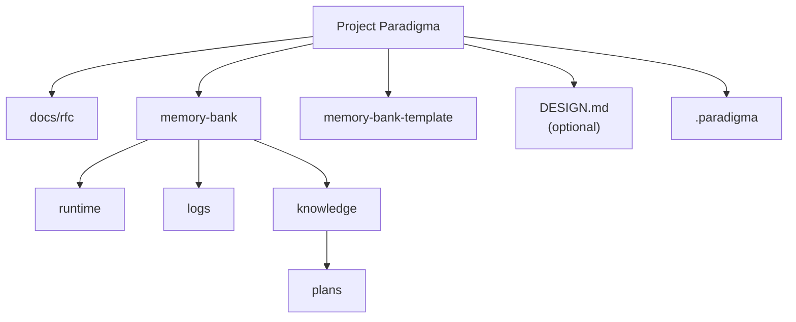

# Project Paradigma

*OKF-compatible Agent Memory Runtime Framework*

当前版本：`0.5.1`

## 核心理念

Project Paradigma 是一个 IDE 无关的 Agent 外部记忆运行框架。它以 OKF-compatible Markdown 知识库为数据基础，以 Paradigma 语义模型定义文档角色，以 Agent Runtime Protocol 规定读取与维护行为，并通过确定性工具链防止记忆腐化。

它解决 LLM 辅助编程中的三个核心痛点：

- **上下文腐化**：会话变长后，Agent 逐渐遗忘早期约定和决策。
- **注意力涣散**：Token 窗口塞入过多细节时，Agent 对架构约束的注意力被稀释。
- **会话间不连续性**：每次新建对话时 Agent 从零开始，无法继承历史上下文。

通过将长期知识、运行状态和操作日志外化到结构化文件中，Paradigma 让 Agent 每次都能快速、可验证地"上车"。

## 当前能力

- **三态 Memory-Bank**：用 `runtime/`、`logs/`、`knowledge/` 分离当前状态、过程记录和长期知识。
- **三层 Planning 架构**：`plans/` 层填补项目愿景与当前任务之间的中期规划空白。plan 按状态自动切换温度（in-progress → WARM，completed → COLD）。
- **OKF-compatible knowledge bundle**：`memory-bank/knowledge/` 与 `docs/rfc/` 中的 concept 文档使用 Markdown + YAML frontmatter。
- **严格生产校验**：本地工具可检查 schema、section、timestamp、policy、relations、links、index checksum 和 HOT 文件体积。
- **分层检索索引**：根 index 保持人工高层导航，子目录生成非递归局部索引，全量机器元数据进入可重建 cache。
- **运行态维护工具**：支持 active task 归档和 progress summary 压缩，保留原始日志不丢失。
- **Harness 诊断器**：`pd-diagnose.py` 可检测衍生项目的 Paradigma 版本差距，指导结构迁移或版本升级。
- **分离版本模型**：发行版本、安装版本、配置 Schema、OKF 和文档 Schema 使用独立字段，并由 `pd-version.py --check` 检测漂移。
- **可选前端设计域**：通过 `DESIGN.md` 集成 `google-labs-code/design.md` 格式，Agent 在涉及前端/UI 任务时自动引用设计 tokens。

---

> 本项目采用 MPL 2.0 协议。
> 你可以自由使用本项目开发商业或闭源项目；如果修改本模板库自身源码，请将修改后的模板库代码开源回馈社区。

---

## 如何使用 / How To Use

### 1. 克隆本项目作为开发基座

推荐方式：在 GitHub 上点击本仓库的 "Use this template" 按钮创建新仓库。

替代方式：手动 clone：

```bash
git clone https://github.com/Marz42/paradigma.git my-new-project
cd my-new-project
git remote remove origin
# git remote add origin https://github.com/<你的用户名>/my-new-project.git
```

### 2. 激活 Memory-Bank 模板

本项目使用三态 Memory-Bank：

- `memory-bank/runtime/`：当前运行状态，例如 active task。
- `memory-bank/logs/`：会话日志和版本日志。
- `memory-bank/knowledge/`：长期知识库，遵循 OKF-compatible Markdown + YAML frontmatter。
  - `knowledge/plans/`：中期计划，多会话/多任务的路标。
- `memory-bank-template/`：空白模板源，按同样结构组织。

实际使用时，将模板复制到运行目录：

macOS / Linux / Git Bash:

```bash
mkdir -p memory-bank/runtime memory-bank/logs memory-bank/knowledge
cp -r memory-bank-template/runtime/* memory-bank/runtime/
cp -r memory-bank-template/logs/* memory-bank/logs/
cp -r memory-bank-template/knowledge/* memory-bank/knowledge/
```

Windows PowerShell:

```powershell
New-Item -ItemType Directory -Force memory-bank/runtime, memory-bank/logs, memory-bank/knowledge
Copy-Item -Recurse -Force memory-bank-template/runtime/* memory-bank/runtime/
Copy-Item -Recurse -Force memory-bank-template/logs/* memory-bank/logs/
Copy-Item -Recurse -Force memory-bank-template/knowledge/* memory-bank/knowledge/
```

然后运行本地检查：

```bash
python -m pip install -r requirements.txt
python .paradigma/tools/pd-index.py rebuild
python .paradigma/tools/pd-check-all.py
```

复制完成后，`memory-bank/` 中的 `.md` 文件就是你的项目记忆，应随代码一起提交。

### 2.1 可选：激活 DESIGN.md（前端项目）

如果你的项目有前端 UI，可以从模板激活 DESIGN.md：

```bash
cp memory-bank-template/DESIGN.md DESIGN.md
```

然后使用 INIT_PROMPT 模式 G（设计器模式）通过对话式问答填充视觉设计规范。

### 3. 配置 IDE 适配器

本项目已内置 Cursor Rule 适配器：`.cursor/rules/memory-bank-protocol.mdc`。

其他 IDE 可根据 `AGENT_RULES.md` 创建对应规则或自定义指令。

### 4. 启动第一个会话

打开 `INIT_PROMPT.md`，根据场景选择模式：

| 你的情况 | 使用模式 | 说明 |
|----------|----------|------|
| 刚 clone，还没初始化 | 模式 F | Agent 帮你完成机械设置 |
| 全新项目，需填充文档 | 模式 A | Agent 作为架构师填充 knowledge |
| 已有项目，需审查状态 | 模式 B | Agent 审查 Memory-Bank 一致性 |
| 已有明确任务 | 模式 C | Agent 跳过审查直接干活 |
| 架构决策讨论 | 模式 D | Agent 分析方案并记录 ADR |
| 需要创建视觉设计规范 | 模式 G | Agent 引导 Q&A 创建 DESIGN.md |
| 旧项目需要结构迁移 | 模式 H | Agent 引导 pre-OKF → 三态结构迁移 |

---

## OKF-Compatible Memory-Bank

`memory-bank/knowledge/` 与 `docs/rfc/` 中，除 `index.md` / `log.md` 外的 `.md` 文件都是 OKF concept 文档，必须包含 YAML frontmatter 和非空 `type`。



### Agent 读取顺序

1. `memory-bank/runtime/active-task.md`
2. `memory-bank/knowledge/index.md`
3. HOT knowledge：project brief、architecture、conventions、repository contract
4. 根据 index 读取 WARM/COLD 文档
5. 若任务涉及前端/UI 且存在 `DESIGN.md`，将其作为额外 WARM 参考
6. 根据 relations 补读必要依赖

### 推荐检查顺序

```bash
python -m pip install -r requirements.txt
python .paradigma/tools/pd-index.py rebuild
python -m unittest discover -s tests -p "test_*.py" -v
python .paradigma/tools/pd-check-all.py
```

常用维护命令：

| 命令 | 用途 |
|------|------|
| `python -m unittest discover -s tests -p "test_*.py" -v` | 运行现有工具的 characterization test 基线 |
| `python .paradigma/tools/pd-version.py --verbose` | 显示发行、安装、配置、OKF 和文档 Schema 版本 |
| `python .paradigma/tools/pd-check-all.py` | 聚合运行版本、strict lint、links、index、hot-size 和 DESIGN.md 基本校验 |
| `python .paradigma/tools/pd-index.py rebuild` | 保持根导航精简，重建子目录局部索引和机器 JSON cache |
| `python .paradigma/tools/pd-index.py verify` | 校验根导航、局部索引和机器 cache 是否与 canonical knowledge 一致 |
| `python .paradigma/tools/pd-sync-index.py --write/--check` | v0.5.x 兼容入口，分别映射到 rebuild/verify |
| `python .paradigma/tools/pd-diagnose.py --upstream <path>` | 检测衍生项目与上游 Paradigma 的版本差距（结构/工具/Schema/配置/协议） |
| `python .paradigma/tools/pd-archive-task.py --dry-run` | 为 `completed` active task 生成归档 mutation plan，不写文件 |
| `python .paradigma/tools/pd-archive-task.py --write` | 原子应用归档计划并将 active-task 重置为 `pending` |
| `python .paradigma/tools/pd-compact-progress.py --write` | 原子替换 progress summary，不删除或改写原始 session logs |

---

## 完整目录结构

```text
paradigma/
├── README.md
├── AGENT_RULES.md
├── INIT_PROMPT.md
├── VERSION
├── requirements.txt                  ← PyYAML 运行时依赖
├── DESIGN.md                         ← 可选，前端视觉设计规范
├── docs/
│   └── rfc/
│       ├── index.md
│       └── paradigma-okf-compatible-runtime.md
├── .cursor/
│   └── rules/
│       └── memory-bank-protocol.mdc
├── .paradigma/
│   ├── config.yaml
│   ├── cache/                         ← ignored，可删除重建的机器索引
│   ├── schemas/
│   │   └── paradigma-types.schema.yaml
│   └── tools/
│       ├── _paradigma_yaml.py
│       ├── _task_state.py
│       ├── _index.py
│       ├── pd-index.py
│       ├── pd-check-all.py
│       ├── pd-version.py
│       ├── _version.py
│       ├── pd-lint-okf.py
│       ├── pd-check-links.py
│       ├── pd-sync-index.py
│       ├── pd-check-hot-size.py
│       ├── pd-diagnose.py
│       ├── pd-archive-task.py
│       └── pd-compact-progress.py
├── .github/
│   └── workflows/
│       └── check.yml
├── tests/
│   └── characterization/
│       └── test_tools.py
├── memory-bank-template/
│   ├── DESIGN.md                     ← DESIGN.md 空白模板
│   ├── runtime/
│   ├── logs/
│   └── knowledge/
│       ├── plans/
│       └── ...
└── memory-bank/
    ├── runtime/
    │   └── active-task.md
    ├── logs/
    │   ├── changelog.md
    │   └── progress/
    │       └── index.md
    └── knowledge/
        ├── index.md
        ├── project-brief.md
        ├── architecture.md
        ├── conventions.md
        ├── glossary.md
        ├── contracts/
        │   └── repository-contract.md
        ├── domains/
        │   ├── protocol.md
        │   ├── tooling.md
        │   ├── design-system.md
        │   ├── plans.md
        │   └── migration-flows.md
        ├── manuals/
        │   ├── paradigma-deploy.md
        │   ├── paradigma-baseline-test.md
        │   ├── paradigma-design-wizard.md
        │   └── paradigma-harness-update.md
        ├── decisions/
        │   ├── adr-001-template-runtime-split.md
        │   ├── adr-002-okf-compatible-memory-runtime.md
        │   └── adr-003-strict-okf-production-rules.md
        ├── known-issues/
        │   ├── fstring-escape-in-compact.md
        │   ├── stale-section-structure-in-adr001.md
        │   └── session-context-fragmentation.md
        └── plans/
            └── pd-next-milestones.md
```

---

## 维护原则

1. **协议源头优先**：协议变更先更新 `AGENT_RULES.md`，再同步 IDE 适配器。
2. **三态分离**：长期知识、运行状态、操作日志不要混写。
3. **三层计划**：vision（project-brief）→ 中期计划（plans/）→ 当前执行（active-task）。Plan 完成后将 temperature 从 warm 切换到 cold。
4. **OKF 严格合规**：knowledge 与 RFC concept 文档应通过 `pd-lint-okf.py --strict`。
5. **关系可检查**：Markdown links、frontmatter relations、index entries 应通过 `pd-check-links.py`。
6. **索引职责分离**：根 index 人工维护高层导航；子目录 block 和机器 cache 由 `pd-index.py` 维护。
7. **版本管理**：模板库结构、协议、路径、规则变更按 `conventions.md` 评估 SemVer。
8. **版本诊断**：衍生项目可用 `pd-diagnose.py --check-version` 快速检查是否需要更新 Harness。
9. **严格任务状态**：active-task 只使用 `pending`、`active`、`blocked`、`completed`、`aborted`；归档必须先 dry-run。

---

## 灵感来源与依赖

本项目受以下项目的启发，并使用了它们定义的标准：

- **[PyYAML](https://pyyaml.org/)** — 工具链统一、安全解析 YAML 与 Markdown frontmatter 的运行时依赖。

- **[EnzeD/vibe-coding](https://github.com/EnzeD/vibe-coding)** — 提出了 AI-assisted development workflow 和结构化项目记忆的理念，为本项目的 Memory-Bank 体系提供了初始灵感。
- **[GoogleCloudPlatform/knowledge-catalog](https://github.com/GoogleCloudPlatform/knowledge-catalog)** — OKF (Open Knowledge Format) v0.1：知识库文档的 Markdown + YAML frontmatter 格式标准。Paradigma 的 `knowledge/` 和 RFC 文档遵循 OKF 格式。
- **[google-labs-code/design.md](https://github.com/google-labs-code/design.md)** — 面向 coding agent 的结构化视觉设计规范格式。Paradigma 通过 `DESIGN.md` 集成该系统，Agent 在涉及前端/UI 任务时自动引用设计 tokens。
