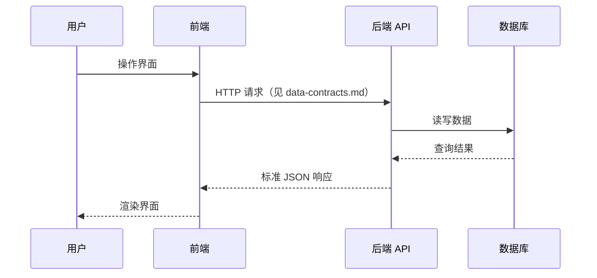

# 系统架构

> 🔥 HOT 知识 — 整体技术栈、顶层目录结构、前后端交互宏观流程。
>
> **使用方式**: 将本文件复制为 `architecture.md`，然后删除占位内容并填入项目实际信息（或保留本文件作为格式参考）。

---

## 技术栈总览

| 层级 | 技术选型 | 版本要求 | 备注 |
|------|----------|----------|------|
| 前端 | [例如 Vue 3 + TypeScript] | [例如 ^3.4] | [例如 Vite 构建] |
| 后端 | [例如 FastAPI + Python] | [例如 ^3.11] | [例如 异步优先] |
| 数据库 | [例如 PostgreSQL] | [例如 16] | [例如 主库] |
| 缓存 | [例如 Redis] | [可选] | [例如 Session / 队列] |
| 部署 | [例如 Docker + Nginx] | — | [例如 单机 / K8s] |

---

## 顶层目录结构

```
project-root/
├── src/                    # [前端或单体应用源码]
│   ├── components/
│   ├── pages/
│   └── ...
├── api/                    # [后端 API，如适用]
├── memory-bank/            # 外部记忆系统（Paradigma）
├── tests/
└── ...
```

> 随项目演进更新此树状图，保持与实际仓库一致。

---

## 前后端交互宏观流程



---

## 核心模块划分

| 模块 | 职责 | 对应目录 / 服务 |
|------|------|-----------------|
| [模块 A] | [一句话职责] | `src/modules/a/` |
| [模块 B] | [一句话职责] | `src/modules/b/` |

---

## 架构约束

- [例如：前端不直接访问数据库，所有数据经 API 层]
- [例如：跨模块通信仅通过 Service 接口，禁止循环依赖]
- [例如：认证统一走 JWT，见 decisions.md ADR-xxx]

---

## 待决事项

- [ ] [例如：是否引入消息队列处理异步任务]
