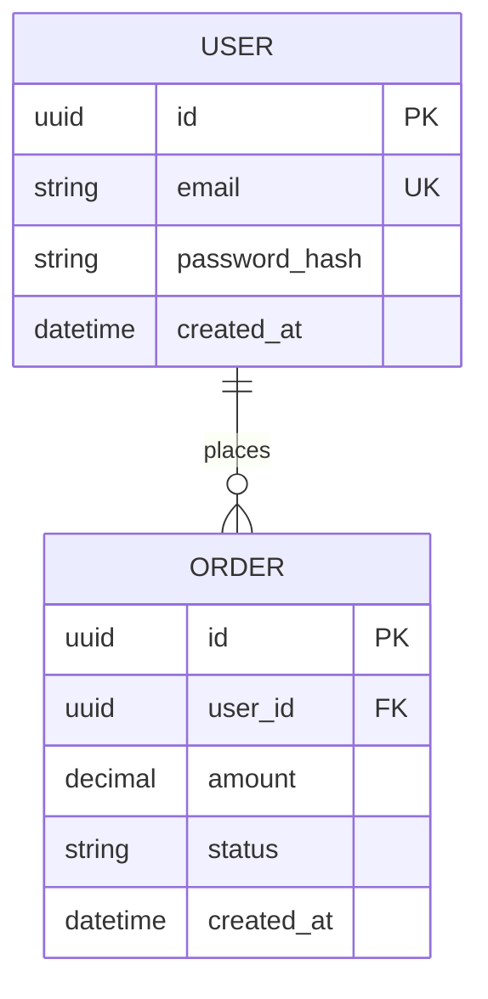

# 数据契约

> 🔥 HOT 知识 — 核心数据库表结构、公共 API 的请求/响应格式（写代码前必读）。
>
> **使用方式**: 将本文件复制为 `data-contracts.md`，然后删除占位内容并填入项目实际契约（或保留本文件作为格式参考）。

---

## 数据库核心实体

### ER 关系图



> 替换为项目实际实体。字段类型、约束、索引须在下方表格中补充说明。

### 实体字段说明

#### `users` 表

| 字段 | 类型 | 约束 | 说明 |
|------|------|------|------|
| id | UUID | PK | 主键 |
| email | VARCHAR(255) | UNIQUE, NOT NULL | 登录邮箱 |
| created_at | TIMESTAMPTZ | NOT NULL | 创建时间 |

---

## 通用 API 响应格式

所有 API 响应均遵循以下信封结构：

```json
{
  "code": 200,
  "message": "success",
  "data": {}
}
```

| 字段 | 类型 | 说明 |
|------|------|------|
| code | number | 业务状态码。200 成功，4xx 客户端错误，5xx 服务端错误 |
| message | string | 人类可读提示 |
| data | object \| array \| null | 业务载荷 |

### 错误响应示例

```json
{
  "code": 400,
  "message": "邮箱格式无效",
  "data": null
}
```

---

## 核心 API 端点

### `POST /api/v1/auth/login`

**请求**:

```json
{
  "email": "user@example.com",
  "password": "string"
}
```

**响应 `data`**:

```json
{
  "token": "jwt-string",
  "expires_at": "2026-01-01T00:00:00Z"
}
```

---

## 变更记录

| 日期 | 变更 | 兼容性 |
|------|------|--------|
| YYYY-MM-DD HH:mm | [初始版本] | — |

> 破坏性变更须升 MAJOR 版本，并先征得用户同意。
