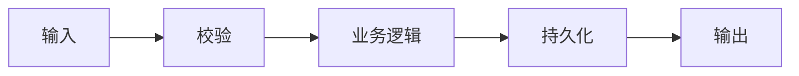

# [模块名称]

> 🌡️ WARM 知识 — 单个子模块的详细设计文档。
>
> **使用方式**: 复制为 `module_1.md`（或按模块重命名，如 `auth.md`），然后填入实际内容。在 `architecture.md` 中维护模块索引。

---

## 模块概览

| 字段 | 内容 |
|------|------|
| **模块名** | [例如：用户认证] |
| **职责** | [一句话：该模块负责什么] |
| **负责人** | [可选] |
| **状态** | [设计中 / 开发中 / 已上线] |

---

## 核心流程

---

## 对外接口

| 接口 | 类型 | 说明 | 契约位置 |
|------|------|------|----------|
| [login] | API | [用户登录] | data-contracts.md § POST /auth/login |
| [AuthService] | 内部 Service | [认证逻辑封装] | `src/services/auth.ts` |

---

## 数据依赖

- 读写的表：[users, sessions]
- 依赖的其他模块：[无 / 邮件模块]

---

## 关键约束

- [例如：密码不得明文存储]
- [例如：Token 有效期 24 小时]

---

## 待办与已知问题

- [ ] [待实现功能]
- 参见 known-issues.md #[问题编号]（如有）
