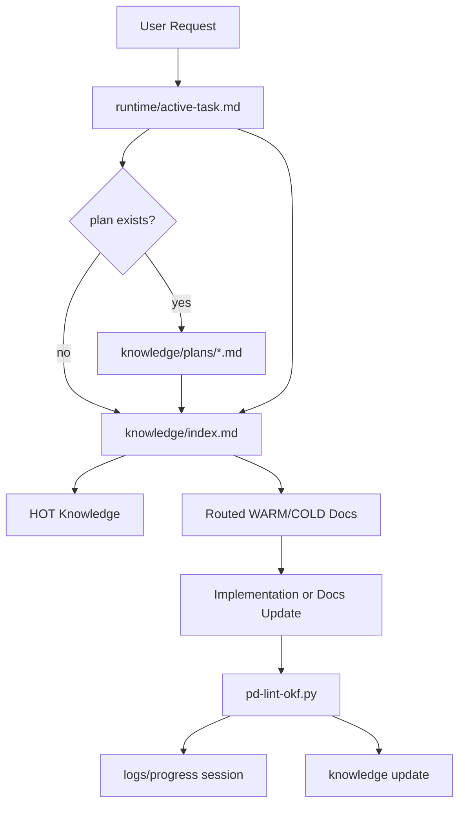

# Overview

Project Paradigma 是一个 OKF-compatible Agent Memory Runtime Framework。它用 Markdown + YAML frontmatter 维护长期知识，用 runtime/logs/knowledge 三态结构区分当前状态、过程记录和可复用知识，并用 `.paradigma/tools/` 中的确定性工具做最小校验和索引同步。

# Technology Stack

| Layer | Choice | Notes |
|-------|--------|-------|
| Knowledge format | OKF-compatible Markdown | Concept 文档使用 YAML frontmatter，至少包含非空 `type` |
| Runtime protocol | `AGENT_RULES.md` + IDE adapters | `AGENT_RULES.md` 是协议源头，Cursor rule 是适配器 |
| Tooling | Python 3.11+ + PyYAML 6.x | 统一 SafeLoader 解析 YAML/frontmatter；其余逻辑优先使用标准库 |
| Versioning | SemVer + separated schema versions | 根 `VERSION` 是发行真相源；workspace 安装版本和各类 Schema 独立追踪 |

# Directory Structure

```text
paradigma/
├── README.md
├── AGENT_RULES.md
├── INIT_PROMPT.md
├── VERSION
├── docs/
│   └── rfc/
├── .cursor/
│   └── rules/
├── .paradigma/
│   ├── config.yaml
│   ├── schemas/
│   └── tools/
├── tests/
│   └── characterization/
├── memory-bank-template/
│   ├── runtime/
│   ├── logs/
│   └── knowledge/
└── memory-bank/
    ├── runtime/
    ├── logs/
    └── knowledge/
```

# Module Boundaries

| Module | Responsibility | Path |
|--------|----------------|------|
| Protocol source | IDE-agnostic Agent runtime rules | `AGENT_RULES.md` |
| Cursor adapter | Cursor-specific always-on rule | `.cursor/rules/memory-bank-protocol.mdc` |
| User entry prompts | Bootstrap and work-mode prompts | `INIT_PROMPT.md` |
| Runtime state | Current active task and ephemeral state | `memory-bank/runtime/` |
| Task archive transaction | Strict state validation, mutation planning, atomic writes, and retry recovery | `.paradigma/tools/pd-archive-task.py` |
| Mid-term plans | Multi-session, multi-task plans bridging vision and execution | `memory-bank/knowledge/plans/` |
| Operational logs | Progress sessions and changelog | `memory-bank/logs/` |
| Knowledge bundle | Long-lived OKF-compatible knowledge | `memory-bank/knowledge/` |
| RFC docs | Paradigma proposals and design drafts | `docs/rfc/` |
| Template source | Blank templates for derived projects | `memory-bank-template/` |
| Deterministic tools | Lint and index utilities | `.paradigma/tools/` |
| Shared YAML parser | Safe YAML/frontmatter parsing and structured diagnostics | `.paradigma/tools/_paradigma_yaml.py` |
| Shared task state | Exact active-task lifecycle parsing used by archive and quality gates | `.paradigma/tools/_task_state.py` |
| Characterization tests | Preserve current CLI and mutation behavior before refactoring | `tests/characterization/` |

# Data Flow



# Key Constraints

- `memory-bank/knowledge/` 和 `docs/rfc/` 中的 concept 文档必须保持 OKF 基本合规。
- `memory-bank/runtime/` 不进入 OKF knowledge bundle，避免短生命周期状态污染长期知识。
- `memory-bank/knowledge/plans/` 中的计划文档按状态切换温度：`in-progress` → WARM，`completed` → COLD。
- `memory-bank/logs/` 以追加为主，不替代 decisions、known issues 或 contracts。
- `index.md` 的 generated block 只能由工具更新，Agent 不应手工编辑 generated block。
- 修改协议源头时必须同步 Cursor rule、README、INIT_PROMPT 和模板目录。
- 根 `VERSION`、`installed_distribution_version`、`config_schema_version`、`okf_version` 与 `document_schema_version` 语义不得混用；`pd-version.py --check` 必须通过。
- YAML/frontmatter 必须通过共享 parser 读取；重复键、非法 UTF-8、语法错误和边界错误必须显式失败，Schema 错误由 lint 层单独报告。
- Active task 状态只能是 `pending`、`active`、`blocked`、`completed`、`aborted`；归档计划绑定 source hash，先原子创建 archive 再原子替换 active-task，并通过 archive ID 支持恢复。

# Open Questions

## 协议与运行时

- **Session 间上下文断裂**：active-task 完成后归档，缺少 handoff 摘要和 task queue 追踪机制。下一个会话的 Agent 只能靠扫描 progress logs 推测上下文。详见 `known-issues/session-context-fragmentation.md`。方案 A（handoff.md）推荐在 v0.5.x 实现。
- **单 Agent 假设**：active-task 是单焦点、单文件。多 Agent 并行工作时没有冲突解决协议，没有 task slot 分配机制。
- **任务暂停语义仍较粗**：`blocked` 已可表达暂时无法推进，`aborted` 可表达终止，但尚未定义带恢复条件和恢复时间的正式 suspended 状态。
- **Read Phase 无分级**：当前 Read Phase 强制读取 active-task + index + 4 个 HOT 文档。即使是修复一个 typo 也需要完整上下文。缺少 "快速路径"（最小读取集 vs 完整读取集）。
- **协议自身无版本号**：`AGENT_RULES.md` 没有版本标识。衍生项目无法区分"这次更新只需要新工具"还是"协议变了必须重读 AGENT_RULES.md"。

## 工具链

- **pd-diagnose 无执行器**：能检测差距，但不能应用更新。`pd-update.py --apply` 推迟到 v0.6.0。
- **知识新鲜度检查**：lint 检查格式正确性，不检查内容是否过时。没有类似 "doc-gardening agent" 的机制自动检测知识腐烂（如 `domains/auth.md` 声称用 bcrypt 但代码已切换到 argon2）。
- **跨文档一致性检查**：`pd-check-links.py` 只检查链接是否存在，不检查内容一致性（如两个文档声明了冲突的约束）。
- **Template Diff**：当上游模板更新时，已激活的衍生项目中对应文件无法感知变化。没有模板版本对比机制。
- **知识文档删除/废弃协议**：frontmatter 有 `epistemic_status: deprecated`，但没有配套工具（自动排除索引、列出受影响文档）。
- **Git 感知**：归档器已有 source hash、原子写入和中断恢复，但 `pd-archive-task.py` 与 `pd-compact-progress.py` 仍不提示未提交的 Git 变更。

## 语义与知识模型

- **温度模型完全静态**：文件温度在 frontmatter 中硬编码。一个文档 3 个月未被 Agent 读取仍是 WARM，一个频繁出现的 known-issue 仍是 COLD。缺少基于时间的温度衰减规则。
- **Type 层级缺失**：类型之间是扁平的。`paradigma-contract` 的 `contract_kind` 是 free-form，工具不会按 kind 做子分组。
- **Relations 只建模静态关系**：缺少 transient depends_on（"仅当 plan X 是 in-progress 时才生效"）、conditional constrains（"如果 PG 则约束 A，如果 Mongo 则约束 B"）、causal relations。
- **知识文档无版本号**：每个文档有 timestamp，但无 per-document version。Agent 无法快速判断"这个文档自上次我读以来变了吗"。
- **Schema 格式**：当前 YAML schema 是轻量说明型。是否升级为可执行 JSON Schema / YAML Schema。

## 用户体验

- **Bootstrap 体验断层**：模式 A 要求用户在首次会话中一次性填充 5+ 个文档。缺少渐进式填充路径和"快速启动"最小模式。
- **无学习路径**：文档对新手密集。缺少按用户角色（纯后端 / 全栈 / 模板维护者）组织的阅读路线。
- **无分支/实验协议**：探索性工作（"试试方案 A vs 方案 B"）没有 knowledge fork 机制。探索中产生的临时文档会直接污染 knowledge bundle。
- **衍生项目兼容性矩阵**：从旧版 Paradigma 升级时，哪些变更是 breaking 需要明确。当前完全依赖文档描述。

# Citations

- [OKF v0.1 Draft](https://raw.githubusercontent.com/GoogleCloudPlatform/knowledge-catalog/main/okf/SPEC.md)
- [Paradigma OKF-Compatible Runtime RFC](../../docs/rfc/paradigma-okf-compatible-runtime.md)
