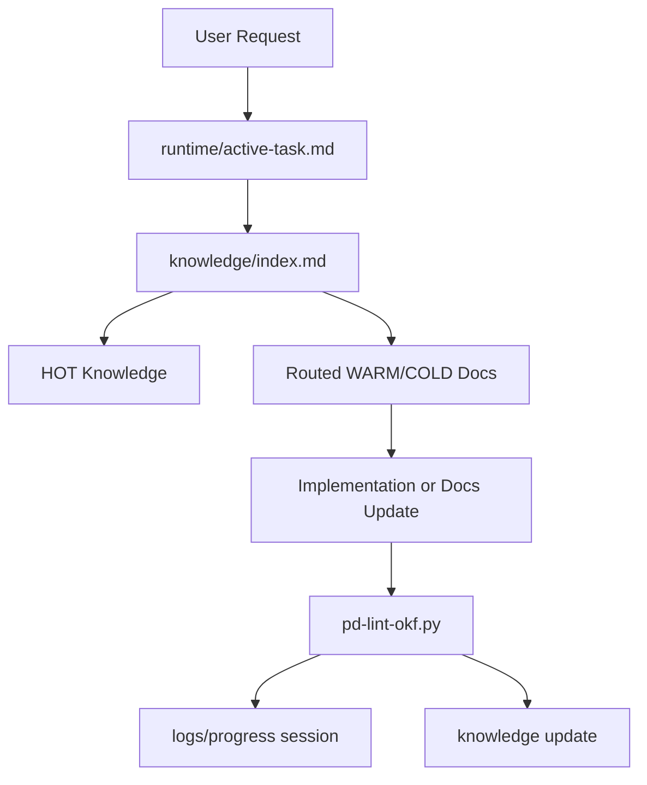

# Overview

Project Paradigma 是一个 OKF-compatible Agent Memory Runtime Framework。它用 Markdown + YAML frontmatter 维护长期知识，用 runtime/logs/knowledge 三态结构区分当前状态、过程记录和可复用知识，并用 `.paradigma/tools/` 中的确定性工具做最小校验和索引同步。

# Technology Stack

| Layer | Choice | Notes |
|-------|--------|-------|
| Knowledge format | OKF-compatible Markdown | Concept 文档使用 YAML frontmatter，至少包含非空 `type` |
| Runtime protocol | `AGENT_RULES.md` + IDE adapters | `AGENT_RULES.md` 是协议源头，Cursor rule 是适配器 |
| Tooling | Python standard library | MVP 工具无第三方依赖 |
| Versioning | SemVer + `VERSION` | 模板库结构和协议变更按 `conventions.md` 评估 |

# Directory Structure

```text
paradigma/
├── README.md
├── AGENT_RULES.md
├── INIT_PROMPT.md
├── VERSION
├── docs/
│   └── rfc/
├── .cursor/
│   └── rules/
├── .paradigma/
│   ├── config.yaml
│   ├── schemas/
│   └── tools/
├── memory-bank-template/
│   ├── runtime/
│   ├── logs/
│   └── knowledge/
└── memory-bank/
    ├── runtime/
    ├── logs/
    └── knowledge/
```

# Module Boundaries

| Module | Responsibility | Path |
|--------|----------------|------|
| Protocol source | IDE-agnostic Agent runtime rules | `AGENT_RULES.md` |
| Cursor adapter | Cursor-specific always-on rule | `.cursor/rules/memory-bank-protocol.mdc` |
| User entry prompts | Bootstrap and work-mode prompts | `INIT_PROMPT.md` |
| Runtime state | Current active task and ephemeral state | `memory-bank/runtime/` |
| Operational logs | Progress sessions and changelog | `memory-bank/logs/` |
| Knowledge bundle | Long-lived OKF-compatible knowledge | `memory-bank/knowledge/` |
| RFC docs | Paradigma proposals and design drafts | `docs/rfc/` |
| Template source | Blank templates for derived projects | `memory-bank-template/` |
| Deterministic tools | Lint and index utilities | `.paradigma/tools/` |

# Data Flow



# Key Constraints

- `memory-bank/knowledge/` 和 `docs/rfc/` 中的 concept 文档必须保持 OKF 基本合规。
- `memory-bank/runtime/` 不进入 OKF knowledge bundle，避免短生命周期状态污染长期知识。
- `memory-bank/logs/` 以追加为主，不替代 decisions、known issues 或 contracts。
- `index.md` 的 generated block 只能由工具更新，Agent 不应手工编辑 generated block。
- 修改协议源头时必须同步 Cursor rule、README、INIT_PROMPT 和模板目录。

# Open Questions

- 是否将 schema 从轻量 YAML 说明升级为可执行 JSON Schema / YAML Schema。
- 是否在 `docs/rfc/` 也生成自动索引，与 `knowledge/` 的索引机制保持一致。
- 是否添加 CI wiring 以在 PR/merge 前自动运行 strict lint + link check + index check 序列。

# Citations

- [OKF v0.1 Draft](https://raw.githubusercontent.com/GoogleCloudPlatform/knowledge-catalog/main/okf/SPEC.md)
- [Paradigma OKF-Compatible Runtime RFC](../../docs/rfc/paradigma-okf-compatible-runtime.md)
